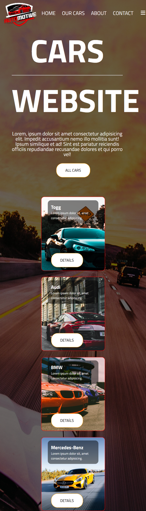
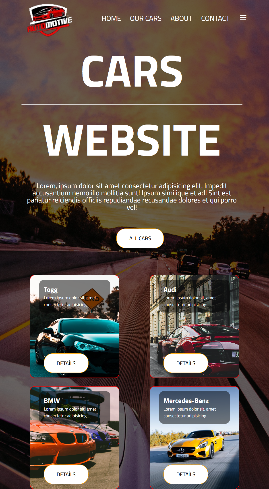

# car-website
A responsive and modern landing page for car brands built with HTML and CSS.
Simple design optimized for desktop, tablet, and mobile devices.

### 🖥️ Live Demo  
🔗 [View Site](https://bariskarakocdev.github.io/car-website/)

---

## 💻 Technologies Used  
- HTML5  
- CSS3  
- Flexbox & Grid Layouts  
- Responsive Media Queries  

---

## 📱 Responsive Design Screenshots  

### 🖥️ Desktop View  

### 📱 Mobile View  

### 📲 Tablet View  

---

## 📁 Project Structure  

car-website/
├── images/
├── screenshots/
│ ├── laptop.png
│ ├── mobile.png
│ └── tablet.png
├── LICENSE
├── README.md
├── index.html
└── style.css

---

## 📝 License  
This project is licensed under the terms of the MIT License.

---

## ✍️ Developer  
[@bariskarakocdev](https://github.com/bariskarakocdev)
